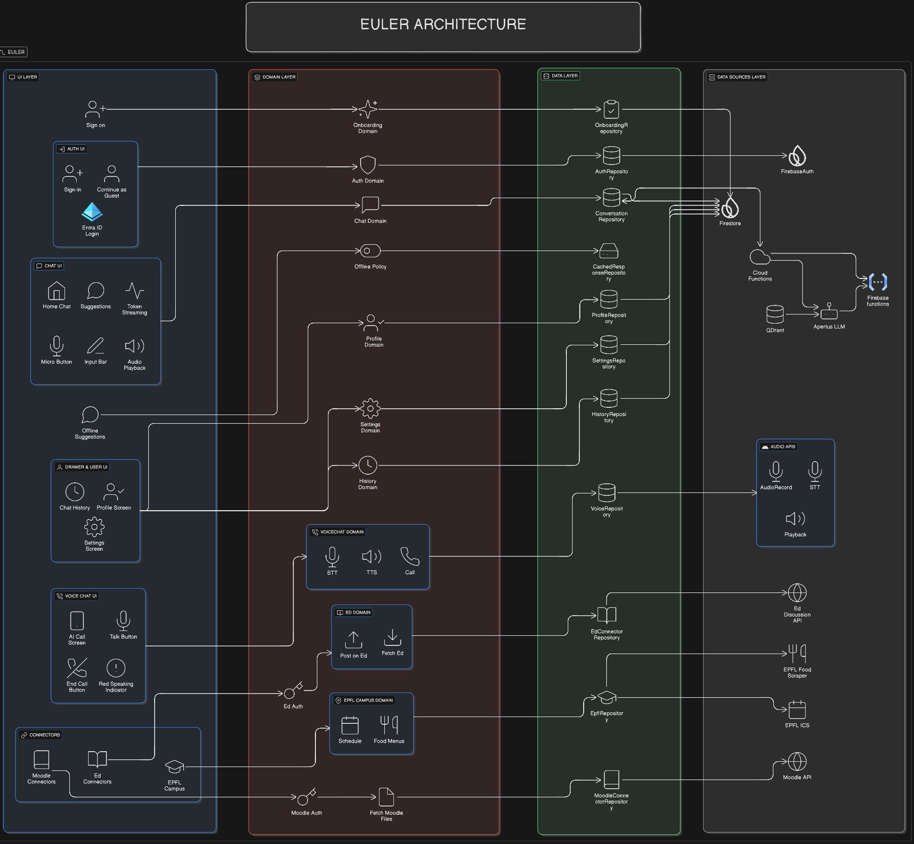

<div align="center">


## Unifying EPFL's Digital Ecosystem Through Conversational AI

Euler helps students navigate EPFL's digital services through natural language. Instead of switching between Moodle, Ed Discussion, EPFL webpages, PocketCampus etc.. students ask questions and Euler executes actions automatically across campus services.

[](https://sonarcloud.io/summary/new_code?id=CS311-Team04_euler)
[](https://sonarcloud.io/summary/new_code?id=CS311-Team04_euler)
[](https://github.com/CS311-Team04/euler/actions/workflows/ci.yml)
[](https://kotlinlang.org/)
[](https://www.android.com/)

</div>

---

## Design (Figma)

The project design is available on Figma:

**[Team Project – Figma](https://www.figma.com/design/FBupCDf8gAEmdhbehg3hdd/M1?node-id=0-1&t=pKoTTtTJcKkT7AOU-1)**

---

## Features

### Core Functionality
- **Conversational AI**: Natural language interface powered by RAG (Retrieval Augmented Generation) with EPFL-specific knowledge
- **Multi-Connector Support**: 
  - **Moodle**: Fetch course files, view course information, access learning resources
  - **Ed Discussion**: Search posts, create new discussion threads, interact with course forums
  - **EPFL Campus Schedule**: Connect personal calendar (ICS) to get schedule-aware answers
  - **EPFL Food Menus**: Query cafeteria menus, find vegetarian options, compare prices
- **Voice Interface**: Full-screen voice chat with speech-to-text and text-to-speech capabilities
- **Offline Mode**: Access predefined responses and cached conversations when offline
- **Multi-language Support**: Localized UI with support for multiple languages
- **Dark/Light Theme**: System-aware appearance with customizable themes
- **Conversation Management**: Create, manage, and switch between multiple conversation threads
- **User Profiles**: Personalize experience with academic information and preferences
- **Onboarding Flow**: Guided setup for new users

### Authentication
- Microsoft Entra ID (OAuth) integration
- Firebase Authentication
- Guest mode support
- Multi-account support
- MoodleCloud Authentification (for testing: username: `test` & password: `Eulerpassword2`)
- ED Authentification

---

## Setup & Installation

### Prerequisites
- **Android Studio** Jellyfish (2024.2.1) or newer
- **Java 17**
- **Firebase project** configured with:
  - Firestore Database
  - Authentication
  - Cloud Functions (optional for backend development)
- **Node.js 20** (for backend functions development)
- **GitHub account** with access to the repository

### Steps

1. **Clone the repository**
   ```bash
   git clone https://github.com/CS311-Team04/euler.git
   cd euler
   ```

2. **Open the project in Android Studio**
   - Open Android Studio
   - Select "Open an Existing Project"
   - Navigate to the cloned repository

3. **Configure Firebase**
   - Add your `google-services.json` file to the `app/` directory
   - Ensure Firebase project has Firestore and Authentication enabled

4. **Configure Backend (Optional - for local development or to get the latest .js file)**
   ```bash
   cd functions
   npm install
   # Configure environment variables in .env file
   npm run build ( to get the latest version of the index.js file from the index.ts file)
   ```

5. **Build and Run**
   ```bash
   ./gradlew assembleDebug
   ```
   Or use Android Studio's build and run functionality

6. **Run the emulator or install the generated APK**

---

## Project Structure

```
euler/
├── app/
│   ├── src/main/java/com/android/sample/
│   │   ├── auth/                    # Microsoft Entra ID, Firebase Auth
│   │   ├── home/                    # Main chat screen, drawer, navigation
│   │   ├── Chat/                    # Chat UI models and message types
│   │   ├── conversations/           # Conversation management and repositories
│   │   ├── epfl/                    # EPFL Campus schedule connector
│   │   ├── llm/                     # LLM client abstraction
│   │   ├── navigation/              # Navigation graph and routing
│   │   ├── network/                 # Network connectivity monitoring
│   │   ├── onboarding/              # User onboarding screens
│   │   ├── profile/                 # User profile management
│   │   ├── settings/                # Settings, connectors, profile screens
│   │   │   └── connectors/          # Moodle and Ed Discussion connectors
│   │   ├── SignIn/                  # Authentication UI
│   │   ├── speech/                  # Speech-to-text and text-to-speech
│   │   ├── splash/                  # Opening/splash screen
│   │   ├── ui/                      # Reusable UI components and themes
│   │   └── VoiceChat/               # Voice chat interface
│   │       ├── Backend/             # Voice chat ViewModel
│   │       └── UI/                  # Voice screen and visualizer
│   └── res/                         # Layouts, strings, drawable resources
├── functions/                       # Firebase Cloud Functions (TypeScript)
│   ├── src/
│   │   ├── connectors/              # Moodle and Ed Discussion connectors
│   │   │   ├── ed/                  # Ed Discussion client and service
│   │   │   └── moodle/              # Moodle client and service
│   │   ├── food/                    # EPFL food scraper
│   │   ├── security/                # Secret encryption/decryption
│   │   ├── tools/                   # Course tools and utilities
│   │   └── utils/                   # Intent parsing and utilities
│   └── package.json                 # Node.js dependencies
├── tools/
│   └── epfl_scraper/                # Python scraper for EPFL education pages
├── data/                            # Sample data and scraped content
├── build.gradle.kts                 # Root Gradle configuration
└── settings.gradle.kts              # Project settings
```

---

## Architecture

### Architecture Diagram

<div align="center">



</div>

### Design Pattern
The app follows the **MVVM (Model-View-ViewModel)** design pattern:

- **Model**: Data repositories (Firebase Firestore, connector services)
- **View**: Jetpack Compose UI components
- **ViewModel**: State management between UI and data layer

### Key Components

#### Frontend (Android - Kotlin)
- **UI Framework**: Jetpack Compose with Material Design 3
- **State Management**: Kotlin Flows and StateFlow
- **Dependency Injection**: Manual dependency injection
- **Networking**: OkHttp for HTTP requests, Firebase SDKs for backend
- **Storage**: 
  - Firebase Firestore for cloud data
  - DataStore for local preferences
  - Offline caching for conversations and responses

#### Backend (Firebase Functions - TypeScript)
- **Runtime**: Node.js 20
- **LLM**: OpenAI/Apertus API integration
- **Embeddings**: Jina embeddings API
- **Vector Database**: Qdrant for RAG semantic search
- **Storage**: Firebase Firestore for user data and connectors
- **Connectors**: Moodle Rest API, ED forum, Pocket Campus website

### Data Flow
1. User input (text or voice) → HomeViewModel
2. HomeViewModel → LLM Client (Firebase Functions)
3. Firebase Functions:
   - Intent detection (schedule, food, Moodle, Ed Discussion, general RAG)
   - Connector service calls (Moodle, Ed Discussion APIs) or RAG retrieval from Qdrant
   - LLM generation with context and memory (rolling summary)
4. Response → HomeViewModel → UI update

---

## Key Features Explained

### RAG (Retrieval Augmented Generation)
- EPFL education pages are scraped and indexed in Qdrant
- User questions trigger hybrid search (dense + sparse vectors)
- Retrieved context is injected into LLM prompts for accurate, source-backed answers

### Connectors
- **Moodle Connector**: Authenticates with Moodle API, fetches course files and information
- **Ed Discussion Connector**: Uses Ed Discussion API to search and post messages
- **EPFL Campus Schedule**: Parses ICS calendar files for schedule-aware responses

### Voice Chat
- Full-screen voice interface with audio level visualization
- Speech-to-text transcription
- Text-to-speech playback
- Real-time audio level monitoring

### Offline Support
- Predefined responses for common questions
- Cached conversation history
- Firestore offline persistence

---

## Continuous Integration (CI/CD)

CI is handled through **GitHub Actions**:

- Builds and lints Kotlin code (`./gradlew build`)
- Runs ktfmt formatting checks
- Publishes APK as a downloadable artifact
- Performs static analysis via SonarCloud
- Runs unit and integration tests

---

## Testing

### Unit Tests
- Located in `app/src/test/`
- Uses JUnit, Mockito, and MockK
- Robolectric for Android component testing

### Integration Tests
- Located in `functions/src/__tests__/`
- Jest for Firebase Functions testing
- Firestore emulator for database tests

### UI Tests
- Located in `app/src/androidTest/`
- Uses Kaspresso and Compose testing libraries

---

## Development

### Running Firebase Functions Locally
```bash
cd functions
npm install
npm run build
firebase emulators:start --only functions
```

### Running Tests
```bash
# Android unit tests
./gradlew testDebugUnitTest

# Android instrumented tests
./gradlew connectedDebugAndroidTest

# Firebase Functions tests
cd functions
npm test
```

### Code Formatting
The project uses ktfmt for Kotlin code formatting:
```bash
./gradlew ktfmtFormat
./gradlew ktfmtCheck
```

---

## Contributing

1. Fork the repository
2. Create a feature branch
3. Make your changes
4. Ensure tests pass and code is formatted
5. Submit a pull request

---

## Team

Euler is developed and maintained by a dedicated team of software engineering students:

| Name | GitHub |
|------|--------|
| Moncef | [@hfzmoncef2](https://github.com/hfzmoncef2) |
| Hamza | [@hamzammt](https://github.com/hamzammt) |
| Yassine | [@babbahy](https://github.com/babbahy) |
| Ziyad | [@ziyad-m97](https://github.com/ziyad-m97) |
| Yahya | [@treaks0](https://github.com/treaks0) |
| Marc | [@marcoff62](https://github.com/marcoff62) |
| Haytam | [@kaspro-coder](https://github.com/kaspro-coder) |

---

## License

This project is part of the CS-311 course at EPFL.

---

## Additional Resources

- Full architecture details available on the Wiki
- Backend API documentation in `functions/src/`
- UI component documentation in `app/src/main/java/com/android/sample/ui/`

---

**Quick Links:** [Features](#features) • [Setup & Installation](#setup--installation) • [Architecture](#architecture) • [Contributing](CONTRIBUTING.md)
